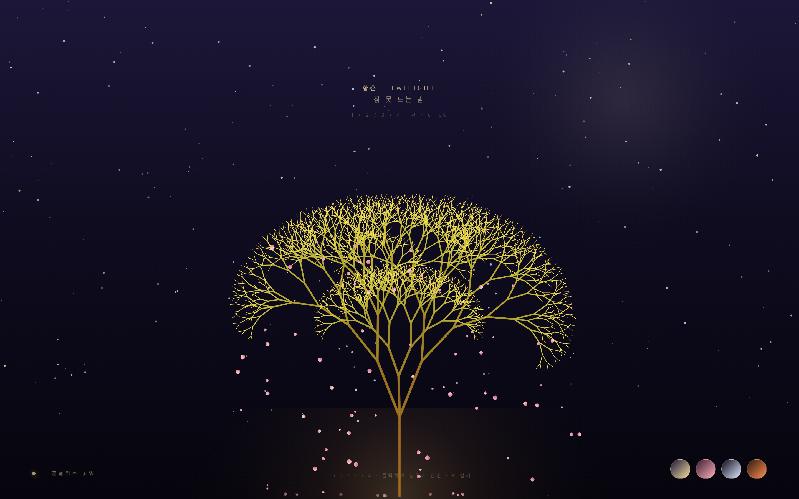
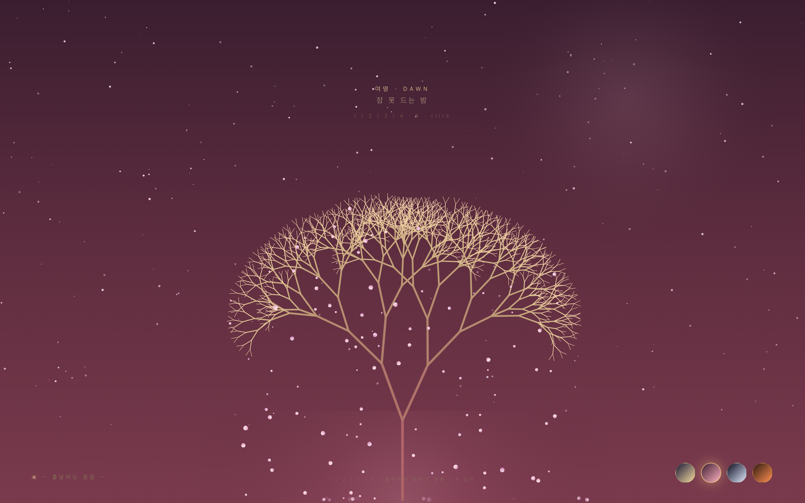
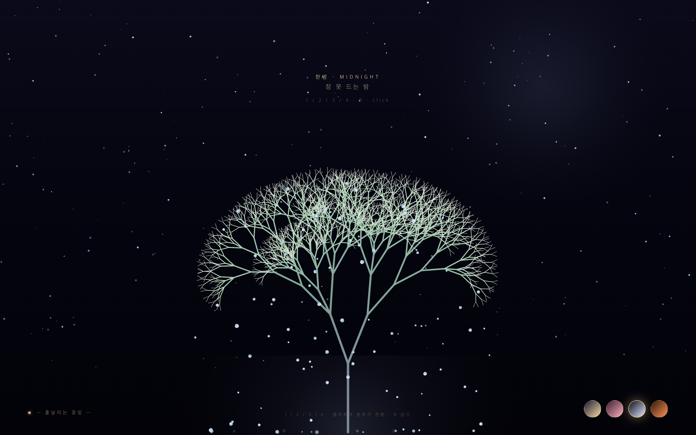
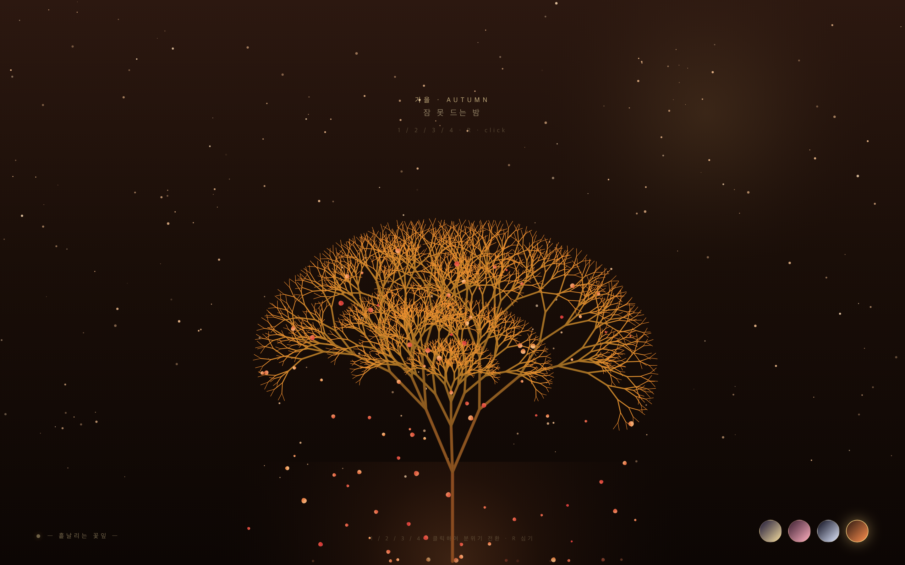

# 🌸 Fractal Tree — Generative Cherry Blossom

화면 바닥에서 자라나는 **황금색 프랙탈 나무**와, 성장이 끝난 가지 끝에서 흩날리는 **벚꽃 입자**의 서정적 제너레이티브 아트.

단일 HTML 파일에 모든 의존관계를 담아, 별도 빌드 없이 브라우저에서 바로 실행됩니다.

---

## ✨ 결정 사항

| # | 결정 | 이유 |
|---|------|------|
| 1 | 단일 HTML5 Canvas | 외부 의존성 0, 더블클릭으로 실행 |
| 2 | 수학적 재귀 함수로 가지 생성 | L-System 미니멀 구현, 구조가 명확 |
| 3 | 성장 애니메이션 = `recursion depth`의 점진적 전개 | 미션 요구사항과 1:1 대응 |
| 4 | 꽃잎은 성장 종료 후 `Particle System`으로 추가 | "바람에 날려 바닥으로 떨어지는" 동작 분리 |
| 5 | 꽃잎은 핑크 + 살짝 알파 + 회전 | 벚꽃의 시각적 정체성 |

---

## 🛠️ 제작 환경

이 저장소의 초기 README와 프로젝트 부트스트랩은 다음 환경에서 진행되었습니다.

| 항목 | 값 |
|------|-----|
| AI 모델 | **MiniMax-M3** (via MiniMax API, MoA fallback chain) |
| 코딩 에이전트 | **[OpenCode](https://github.com/anomalyco/opencode)** v1.17.13 |
| 플랫폼 | macOS (Apple Silicon / M4) |
| 라이선스 | MIT |

> 핵심 알고리즘(`index.html`의 `<script>` 블록)은 위 환경의 **MiniMax-M3** 모델이 OpenCode CLI를 통해 작성했습니다.

---

## 📜 원본 미션 프롬프트

이 프로젝트는 아래 프롬프트를 **그대로** MiniMax-M3에 전달하여 생성되었습니다.

> 수학적 재귀 함수(Recursion)를 사용하여 화면 바닥에서부터 기하학적인 황금색 나무가 서서히 자라나며 가지를 치는 L-System 애니메이션을 구현하고, 성장이 끝난 가지 끝에서는 벚꽃 잎 같은 핑크색 파티클이 생성되어 바람에 날려 바닥으로 떨어지는 서정적이고 감성적인 제너레이티브 아트를 코딩해줘.
>
> **Implementation Advice:** Use HTML5 Canvas. Build a recursive function for the branches (Fractal Tree). For the falling petals, create a simple particle system array after the tree finishes "growing" (animating the recursion depth). 모든 의존관계의 코드를 하나의 HTML에 담는 형태로 코드 작성.

요구사항 체크리스트:

- [x] 수학적 재귀 함수 (Recursion) 기반 가지 생성
- [x] 화면 바닥에서 위로 자라나는 L-System 애니메이션
- [x] 황금색 기하학적 나무
- [x] 성장 종료 후 꽃잎 입자 시스템
- [x] 핑크색 벚꽃 + 바람 + 낙하
- [x] HTML5 Canvas + 단일 HTML (의존성 0)

---

## 📁 구조

```
fractal-tree/
├── index.html        ← 전체 앱 (HTML + CSS + Canvas + JS)
└── README.md
```

별도 의존성 없음. `index.html`을 브라우저로 열면 바로 실행됩니다.

---

## ▶️ 실행

```bash
# 옵션 1: 브라우저에서 직접 열기
open index.html

# 옵션 2: 로컬 서버 (권장)
python3 -m http.server 8000
# → http://localhost:8000
```

---

## 🗺️ 로드맵

- [x] **v0.1** — 기본 재귀 트리 + 황금색 그라데이션 + 성장 애니메이션
- [x] **v0.2** — 꽃잎 입자 시스템 (바람 + 낙하)
- [x] **v0.2.1** — 인터랙션 (버튼 / 클릭 / 키보드로 새 나무 심기)
- [x] **v0.3** — 성장 안정화 (느린 리듬으로 고도화, 시드별 트리 종 변화, 꽃잎 음영, 지면 따뜻한 광)
- [x] **v0.4** — 정적 강화 (꽃잎 흔들림 대폭 감소, 별 깜빡임 약화, 종단속도 안정화, 살짝 흩어지는 자태)
- [x] **v0.5** — 4가지 분위기 팔레트 (황혼/여명/한밤/가을) + 0.6초 부드러운 색천이, 마우스 바람, 꽃잎 안착, 부유 먼지, 시드 이름
- [ ] **v0.6** — 꽃잎 개수 / 나무 매개변수 슬라이더
- [ ] **v0.7** — 사운드 (바람 ambient) + 시간대 자동 전환

---

## ✨ 인터랙션 (v0.5)

| 입력 | 동작 |
|------|------|
| **키보드** `1` | 황혼 (Twilight) — 황금 트리 + 분홍 꽃잎 |
| **키보드** `2` | 여명 (Dawn) — 로즈골드 트리 + 부드러운 핑크 꽃잎 |
| **키보드** `3` | 한밤 (Midnight) — 실버 트리 + 푸른 빛 꽃잎 |
| **키보드** `4` | 가을 (Autumn) — 구리 트리 + 주황/빨강 꽃잎 |
| **키보드** `R` / `Space` | 현재 팔레트에서 새 나무 심기 (시드명 갱신) |
| **마우스 이동** | 커서 X 위치가 꽃잎에 부드러운 바람 (8초간 서서히 사라짐) |
| **마우스 클릭** | 캔버스 어디든 — 새 나무 심기 |
| **스와치 클릭** | 우측 하단 4개 원 — 같은 팔레트로 전환 |
| **창 크기 변경** | 캔버스 자동 리사이즈 |

## 🌸 구현 디테일 (v0.5)

### 4가지 분위기 팔레트
- 각 팔레트: 배경 그라데이션 + 달빛 후광 + 별 색상 + 트리 색상 가족(3-5 변형) + 꽃잎 색조 범위 + 지면 따뜻한 광 + 비네트 강도
- **0.6초 부드러운 색천이** — RGB 성분 단위로 lerp, `easeInOut` 적용
- 시드별 트리 색상 변형: 황혼(5), 여명(4), 한밤(4), 가을(4) = **총 17가지 다른 황금빛**

### 트리 (재귀 + 시드별 종 변화)
- 깊이 9 레벨, 각 단계마다 두 개의 자식 가지 + 가끔 작은 보조 가지
- **시드별 5D 매개변수 변화**: 좌/우 가지 비대칭, 트렁크 두께, 3번째 가지 확률, 가지 각도 폭, 가지 길이 감쇠
- **느린 성장**: 10.5초 풀 그로스 — 정적인 결과물
- 두께는 깊이에 반비례
- 트리는 성장 후 *정적* (흔들림 없음)

### 꽃잎 입자 시스템 (v0.5: 안착 추가)
- 최대 동시 150개, **종단속도 0.77–0.95 px/frame**
- **수평 표류: ±0.06 px/frame** + 마우스 바람 바이어스 (8초간 서서히 사라짐)
- **꽃잎 안착**: 화면 바닥(`y > H-6`)에 닿으면 정지하고 **1.5초간 우아하게 페이드 아웃** (이전: 그냥 사라짐)
- **수직 그라데이션 채움** + 내부 하이라이트 + 림 그림자 → 3D 컵 모양
- 크기 3.2–8.8 px
- 가지 끝에서만 스폰 (~11/sec)
- 색조는 *현재 팔레트*의 hue/sat/lum 범위에서 가져옴 → 팔레트 전환 시 새 꽃잎은 새 색상

### 대기 (Atmospheric depth)
- **지면 따뜻한 광** — 트렁크 밑에 팔레트별 색 풀이, 성장에 맞춰 밝아짐
- **부드러운 캐노피 워시** — 성장 종료 직후 `sin(π·settleT)` 로 1.2초간 빛이 피었다 가라앉음
- **Vignette** — 중앙은 또렷, 가장자리로 갈수록 어둠이 깊어짐 (팔레트별 강도)
- **부유 먼지 (motes)** — 7개의 작은 입자가 화면을 천천히 떠다님 (루프)
- **달빛 후광** — 팔레트별 색조 (황혼=따뜻한 노랑, 한밤=차가운 파랑)
- **별 220개** — 팔레트별 색상 (황혼=노랑/파랑, 한밤=흰색, 가을=호박색)

### 시드별 시적 이름
- 매 심기마다 28개 한국어 시구 중 무작위 선택 (별빛 아래 정원, 고요한 새벽, 봄의 첫숨, ...)
- 우측 상단 라벨에 표시

### 전체 페이즈 타임라인 (v0.5)

| 시간 | 상태 |
|------|------|
| 0–10.5초 | `— 자라나는 중 —` 트리가 9단계 재귀를 통해 천천히 자라남 |
| 10.5–11.7초 | `— 만개 —` 캐노피에 부드러운 따뜻한 빛이 피어남 |
| 11.7초~ | `— 흩날리는 꽃잎 —` 꽃잎이 가지 끝에서 생성되어 천천히 떨어짐 |
| 바닥 도달 | `—` 꽃잎이 1.5초간 안착 페이드 |

---

## 🖼️ 미리보기 — 4가지 분위기

| 황혼 (Twilight) | 여명 (Dawn) |
|-------------------|---------------|
|  |  |
| 황금 트리 + 분홍 꽃잎 | 로즈골드 트리 + 부드러운 핑크 꽃잎 |

| 한밤 (Midnight) | 가을 (Autumn) |
|--------------------|---------------|
|  |  |
| 실버 트리 + 푸른 빛 꽃잎 | 구리 트리 + 주황/빨강 꽃잎 |

(Playwright Chromium 1.61 헤드리스 캡처. 1440×900, DPR 2)

---

## 📜 라이선스

MIT